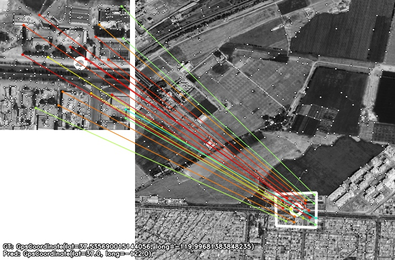
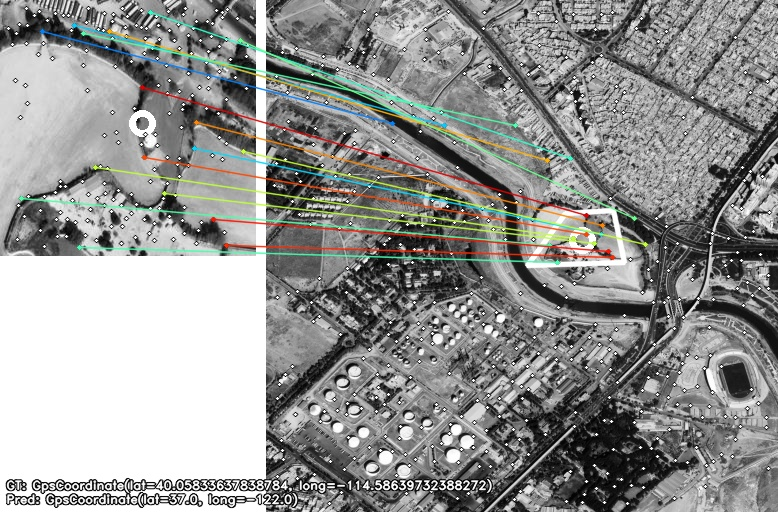

# SuperGlue Visual Localization

A GUI application for visual localization using SuperGlue and SuperPoint.

## Features

- Advanced image matching using SuperGlue deep learning model
- GUI interface for easy parameter configuration and visualization
- Support for image preprocessing and metadata generation
- Real-time progress tracking and result visualization
- Export capability for match results and metrics

## Installation

1. Clone this repository
2. Install dependencies: `pip install -r requirements.txt`
3. Run the application: `python visual_localization_gui.py`

## Usage

1. Select reference and query image folders
2. Configure algorithm parameters
3. Start processing
4. View and analyze results

## Examples

